## Abstract 

Planning has been very successful for control tasks with known environment dynamics. To leverage planning in unknown environments, the agent needs to learn the dynamics from interactions with the world. However, learning dynamics models that are accurate enough for planning has been a long-standing challenge, especially in image-based domains. We propose the Deep Planning Network (PlaNet), a purely model-based agent that learns the environment dynamics from images and chooses actions through fast online planning in latent space. To achieve high performance, the dynamics model must accurately predict the rewards ahead for multiple time steps. We approach this problem using a latent dynamics model with both deterministic and stochastic transition components and a multi-step variational inference objective that we call latent overshooting. Using only pixel observations, our agent solves continuous control tasks with contact dynamics, partial observability, and sparse rewards, which exceed the difficulty of tasks that were previously solved by planning with learned models. PlaNet uses substantially fewer episodes and reaches final performance close to and sometimes higher than strong model-free algorithms.

______

## Introduction

Planning is a natural and powerful approach to decision making problems with known dynamics, such as game playing and simulated robot control <dt-cite key="tassa2012mpc,silver2017alphago,moravvcik2017deepstack"></dt-cite>. To plan in unknown environments, the agent needs to learn the dynamics from experience. Learning dynamics models that are accurate enough for planning has been a long-standing challenge. Key difficulties include model inaccuracies, accumulating errors of multi-step predictions, failure to capture multiple possible futures, and overconfident predictions outside of the training distribution.

Planning using learned models offers several benefits over model-free reinforcement learning. First, model-based planning can be more data efficient because it leverages a richer training signal and does not require propagating rewards through Bellman backups. Moreover, planning carries the promise of increasing performance just by increasing the computational budget for searching for actions, as shown by <dt-cite key="silver2017alphago">Silver et al.</dt-cite>. Finally, learned dynamics can be independent of any specific task and thus have the potential to transfer well to other tasks in the environment.

Recent work has shown promise in learning the dynamics of simple low-dimensional environments <dt-cite key="deisenroth2011pilco,gal2016deeppilco,amos2018awareness,chua2018pets,henaff2018planbybackprop"></dt-cite>. However, these approaches typically assume access to the underlying state of the world and the reward function, which may not be available in practice. In high-dimensional environments, we would like to learn the dynamics in a compact latent space to enable fast planning. The success of such latent models has been limited to simple tasks such as balancing cartpoles and controlling 2-link arms from dense rewards <dt-cite key="watter2015e2c,banijamali2017rce"></dt-cite>.

<video class="b-lazy" data-src="assets/mp4/planet_intro.mp4" type="video/mp4" autoplay muted playsinline loop style="display: block; margin: auto; width: 100%;" ></video>
<figcaption>
PlaNet learns a latent dynamics model to predict future images and rewards. This encodes the idea that the future can be explained by a sequence of compact hidden states. For example, the arm of a robot is a long list of pixels in the image but predicting its movement requires only a few numbers, its position and velocity. A latent dynamics model can learn these compact states without any domain knowledge.
</figcaption>

In this paper, we propose the Deep Planning Network (PlaNet), a model-based agent that learns the environment dynamics from pixels and chooses actions through online planning in a compact latent space. To learn the dynamics, we use a transition model with both stochastic and deterministic components and train it using a generalized variational objective that encourages multi-step predictions. PlaNet solves continuous control tasks from pixels that are more difficult than those previously solved by planning with learned models.

<figcaption>PlaNet solves several control tasks from images in under 2000 attempts. The animation shows the image inputs as the agent is solving each task. The tasks include partial observability, contacts with the ground, sparse rewards for catching a ball, and controlling a challenging bipedal robot.</figcaption>
<video class="b-lazy" data-src="assets/mp4/combined.mp4" type="video/mp4" autoplay muted playsinline loop style="display: block; margin: auto; width: 100%;" ></video>
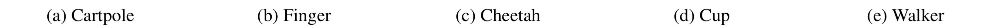
<figcaption>
Figure 1: Image-based control domains used in our experiments. The figure shows agent observations before downscaling them to 64x64x3 pixels. 
(a) For the cartpole balance and swingup tasks, the camera is fixed so the cart can move out of sight. 
(b) The finger spinning task includes contacts between the finger and the object. 
(c) The cheetah running task includes both contacts and a larger number of joints. 
(d) The cup task has a sparse reward that is only given once the ball is caught. 
(e) The walker task requires balance and predicting difficult interactions with the ground.
</figcaption>

Key contributions of this work are summarized as follows:

- **Planning in latent spaces**&nbsp;&nbsp; We solve a variety of tasks from the DeepMind control suite, shown in Figure 1, by learning a dynamics model and efficiently planning in its latent space. Our agent substantially outperforms the model-free A3C and in some cases D4PG algorithm in final performance, with on average 50x less environment interaction and similar computation time.

- **Recurrent state space model**&nbsp;&nbsp; We design a latent dynamics model with both deterministic and stochastic components <dt-cite key="buesing2018dssm,chung2015vrnn"></dt-cite>. Our experiments indicate having both components to be crucial for high planning performance.

- **Latent overshooting**&nbsp;&nbsp; We generalize the standard variational bound to include multi-step predictions. Using only terms in latent space results in a fast and effective regularizer that improves long-term predictions and is compatible with any latent sequence model.

## Latent Space Planning

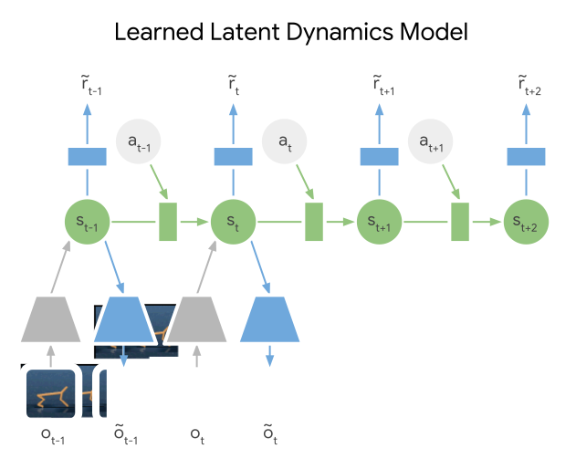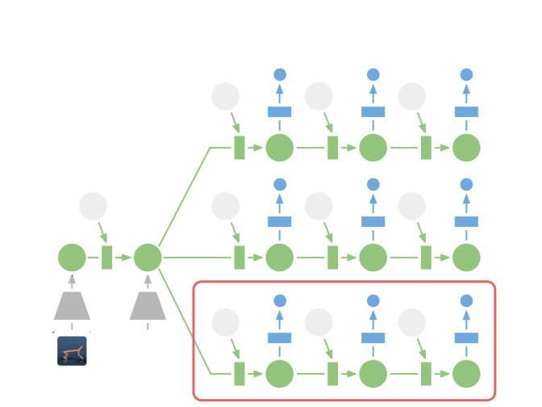
<figcaption> 
PlaNet models the world as a compact sequence of hidden states. For planning, we first encode the history of past images into the current state. From there, we efficiently predict future rewards for multiple action sequences in latent space. We execute the first action of the best sequence found and replan after observing the next image.
</figcaption>

To solve unknown environments via planning, we need to model the environment dynamics from experience. PlaNet does so by iteratively collecting data using planning and training the dynamics model on the gathered data. In this section, we introduce notation for the environment and describe the general implementation of our model-based agent. In this section, we assume access to a learned dynamics model. Our design and training objective for this model are detailed later on in the *Recurrent State Space Model* and *Latent Overshooting* sections respectively.

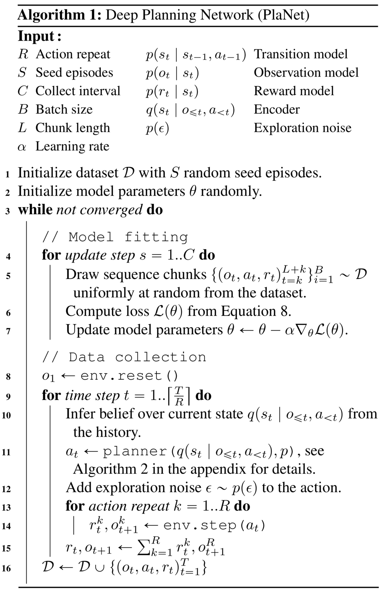

**Problem setup**&nbsp;&nbsp; Since individual image observations generally do not reveal the full state of the environment, we consider a partially observable Markov decision process (POMDP). We define a discrete time step $t$, hidden states $s_t$, image observations $o_t$, continuous action vectors $a_t$, and scalar rewards $r_t$, that follow the stochastic dynamics:

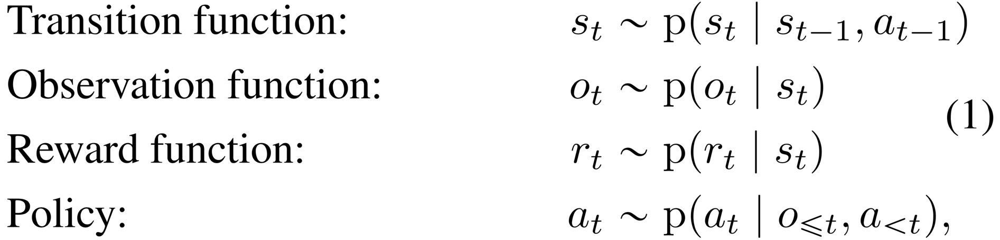

where we assume a fixed initial state $s_0$ without loss of generality. The goal is to implement a policy $p(a_t|o_{\leq t},a_{\lt t})$ that maximizes the expected sum of rewards $E_{p}[ \sum_{\tau=t+1}^T p(r_\tau|s_\tau) ]$, where the expectation is over the distributions of the environment and the policy.

**Model-based planning**&nbsp;&nbsp; PlaNet learns a transition model $p(s_t|s_{t-1},a_{t-1})$, observation model $p(o_t|s_t)$, and reward model $p(r_t|s_t)$ from previously experienced episodes (note italic letters for the model compared to upright letters for the true dynamics). The observation model provides a training signal but is not used for planning. We also learn an encoder $q(s_t|o_{\leq t},a_{\lt t})$ to infer an approximate belief over the current hidden state from the history using filtering. Given these components, we implement the policy as a planning algorithm that searches for the best sequence of future actions. We use model-predictive control (MPC) <dt-cite key="richards2005mpc"></dt-cite> to allow the agent to adapt its plan based on new observations, meaning we replan at each step. In contrast to model-free and hybrid reinforcement learning algorithms, we do not use a policy network.

**Experience collection**&nbsp;&nbsp; Since the agent may not initially visit all parts of the environment, we need to iteratively collect new experience and refine the dynamics model. We do so by planning with the partially trained model, as shown in Algorithm 1. Starting from a small amount of $S$ seed episodes collected under random actions, we train the model and add one additional episode to the data set every $C$ update steps. When collecting episodes for the data set, we add small Gaussian exploration noise to the action. To reduce the planning horizon and provide a clearer learning signal to the model, we repeat each action $R$ times, as is common in reinforcement learning <dt-cite key="mnih2015dqn,mnih2016a3c"></dt-cite>.

**Planning algorithm**&nbsp;&nbsp; We use the cross entropy method (CEM) <dt-cite key="rubinstein1997cem,chua2018pets"></dt-cite> to search for the best action sequence under the model, as outlined in Algorithm 2 in the appendix section of our paper. We decided on this algorithm because of its robustness and because it solved all considered tasks when given the true dynamics for planning. CEM is a population-based optimization algorithm that infers a distribution over action sequences that maximize the objective. As detailed in Algorithm 2, we initialize a time-dependent diagonal Gaussian belief over optimal action sequences $a_{t:t+H}\sim N(\mu_{t:t+H},\sigma^2_{t:t+H} I)$, where $t$ is the current time step of the agent and $H$ is the length of the planning horizon. Starting from zero mean and unit variance, we repeatedly sample $J$ candidate action sequences, evaluate them under the model, and re-fit the belief to the top $K$ action sequences. After $I$ iterations, the planner returns the mean of the belief for the current time step, $\mu_t$. Importantly, after receiving the next observation, the belief over action sequences starts from zero mean and unit variance again to avoid local optima.

To evaluate a candidate action sequence under the learned model, we sample a state trajectory starting from the current state belief, and sum the mean rewards predicted along the sequence. Since we use a population-based optimizer, we found it sufficient to consider a single trajectory per action sequence and thus focus the computational budget on evaluating a larger number of different sequences. Because the reward is modeled as a function of the latent state, the planner can operate purely in latent space without generating images, which allows for fast evaluation of large batches of action sequences.

The next section introduces the latent dynamics model that the planner uses.

## Recurrent State Space Model

<figcaption>Figure 2: Latent dynamics model designs. In this example, the model observes the first two time steps and predicts the third. Circles represent stochastic variables and squares deterministic variables. Solid lines denote the generative process and dashed lines the inference model. 
</figcaption>
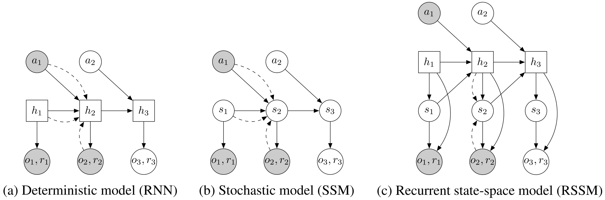
<figcaption> 
(a) Transitions in a recurrent neural network are purely deterministic. This prevents the model from capturing multiple futures and makes it easy for the planner to exploit inaccuracies. 
(b) Transitions in a state-space model are purely stochastic. This makes it difficult to remember information over multiple time steps. 
(c) We split the state into stochastic and deterministic parts, allowing the model to robustly learn to predict multiple futures.
</figcaption>

For planning, we need to evaluate thousands of action sequences at every time step of the agent. Therefore, we use a recurrent state-space model (RSSM) that can predict forward purely in latent space, similar to recently proposed models <dt-cite key="karl2016dvbf,buesing2018dssm,doerr2018prssm"></dt-cite>. This model can be thought of as a non-linear Kalman filter or sequential VAE. Instead of an extensive comparison to prior architectures, we highlight two findings that can guide future designs of dynamics models: our experiments show that both stochastic and deterministic paths in the transition model are crucial for successful planning. In this section, we remind the reader of latent state-space models and then describe our dynamics model.

**Latent dynamics**&nbsp;&nbsp; We consider sequences $\{o_t,a_t,r_t\}_{t=1}^{T}$ with discrete time step $t$, high-dimensional image observations $o_t$, continuous action vectors $a_t$, and scalar rewards $r_t$. A typical latent state-space model is shown in Figure 2b and resembles the structure of a partially observable Markov decision process. It defines the generative process of the images and rewards using a hidden state sequence $\{s_t\}_{t=1}^T$,

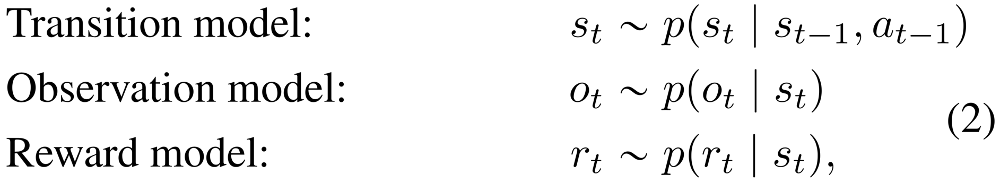

where we assume a fixed initial state $s_0$ without loss of generality. The transition model is Gaussian with mean and variance parameterized by a feed-forward neural network, the observation model is Gaussian with mean parameterized by a deconvolutional neural network and identity covariance, and the reward model is a scalar Gaussian with mean parameterized by a feed-forward neural network and unit variance. Note that the log-likelihood under a Gaussian distribution with unit variance equals the mean squared error up to a constant.

**Variational encoder**&nbsp;&nbsp; Since the model is non-linear, we cannot directly compute the state posteriors that are needed for parameter learning. Instead, we use an encoder $q(s_{1:T}|o_{1:T},a_{1:T})$ $=$ $\prod_{t=1}^T q(s_t|s_{t-1},a_{t-1},o_t)$ to infer approximate state posteriors from past observations and actions, where $q(s_t|s_{t-1},a_{t-1},o_t)$ is a diagonal Gaussian with mean and variance parameterized by a convolutional neural network followed by a feed-forward neural network. We use the filtering posterior that conditions on past observations since we are ultimately interested in using the model for planning, but one may also use the full smoothing posterior during training <dt-cite key="babaeizadeh2017sv2p"></dt-cite>.

**Training objective**&nbsp;&nbsp; Using the encoder, we construct a variational bound on the data log-likelihood. For simplicity, we write losses for predicting only the observations -- the reward losses follow by analogy. The variational bound obtained using Jensen's inequality is

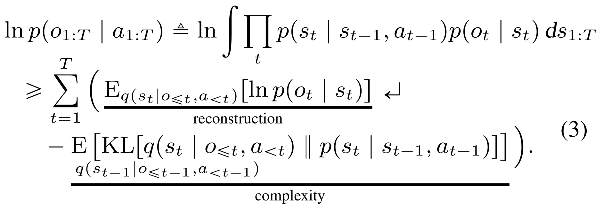

For the derivation, please see Equation 9 in the appendix of the paper. Estimating the outer expectations using a single reparameterized sample yields an efficient objective for inference and learning in non-linear latent variable models that can be optimized using gradient ascent <dt-cite key="kingma2013vae,rezende2014vae,krishnan2017ssmelbo"></dt-cite>.

**Deterministic path**&nbsp;&nbsp; Despite its generality, the purely stochastic transitions make it difficult for the transition model to reliably remember information for multiple time steps. In theory, this model could learn to set the variance to zero for some state components, but the optimization procedure may not find this solution. This motivates including a deterministic sequence of activation vectors $h_t$, $t \in 1 \ldots T$ that allow the model to access not just the last state but all previous states deterministically <dt-cite key="chung2015vrnn,buesing2018dssm"></dt-cite>. We use such a model, shown in Figure 2, that we name recurrent state-space model (RSSM),

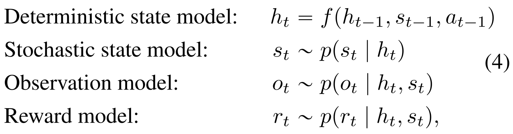

where $f(h_{t-1},s_{t-1},a_{t-1})$ is implemented as a recurrent neural network (RNN). Intuitively, we can understand this model as splitting the state into a stochastic part $s_t$ and a deterministic part $h_t$, which depend on the stochastic and deterministic parts at the previous time step through the RNN. We use the encoder $q(s_{1:T}|o_{1:T},a_{1:T})=\prod_{t=1}^T q(s_t|h_t,o_t)$ to parameterize the approximate state posteriors. Importantly, all information about the observations must pass through the sampling step of the encoder to avoid a deterministic shortcut from inputs to reconstructions.

**Global prior**&nbsp;&nbsp; The model can be trained using the same loss function (Equation 3). In addition, we add a fixed global prior to prevent the posteriors from collapsing in near-deterministic environments. This alleviates overfitting to the initially small training data set and grounds the state beliefs (since posteriors and temporal priors are both learned, they could drift in latent space). The global prior adds additional KL-divergence loss terms from each posterior to a standard Gaussian. Another interpretation of this is to define the prior at each time step as product of the learned temporal prior and the global fixed prior. In the next section, we identify a limitation of the standard objective for latent sequence models and propose a generalization of it that improves long-term predictions.

## Latent Overshooting

<figcaption>Figure 3: Unrolling schemes.
The labels <math><semantics><mrow><msub><mi>s</mi><mrow><mi>i</mi><mi mathvariant="normal">∣</mi><mi>j</mi></mrow></msub></mrow><annotation encoding="application/x-tex">s_{i|j}</annotation></semantics></math>s​i∣j​​ are short for the state at time <math><semantics><mrow><mi>i</mi></mrow><annotation encoding="application/x-tex">i</annotation></semantics></math>i conditioned on observations up to time <math><semantics><mrow><mi>j</mi></mrow><annotation encoding="application/x-tex">j</annotation></semantics></math>j.
Arrows pointing at shaded circles indicate log-likelihood loss terms. Wavy arrows indicate KL-divergence loss terms. 
</figcaption>
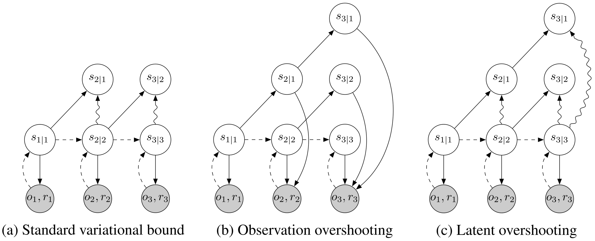
<figcaption> 
(a) The standard variational objectives decodes the posterior at every step to compute the reconstruction loss. It also places a KL on the prior and posterior at every step, which trains the transition function for one-step predictions. 
(b) Observation overshooting <dt-cite key="amos2018awareness"></dt-cite> decodes all multi-step predictions to apply additional reconstruction losses. This is typically too expensive in image domains. 
(c) Latent overshooting predicts all multi-step priors. These state beliefs are trained towards their corresponding posteriors in latent space to encourage accurate multi-step predictions.
</figcaption>

In the previous section, we derived the typical variational bound for learning and inference in latent sequence models (Equation 3). As show in Equation 3, this objective function contains reconstruction terms for the observations and KL-divergence regularizers for the approximate posteriors. A limitation of this objective is that the transition function $p(s_t|s_{t-1},a_{t-1})$ is only trained via the KL-divergence regularizers for one-step predictions: the gradient flows through $p(s_t|s_{t-1},a_{t-1})$ directly into $q(s_{t-1})$ but never traverses a chain of multiple $p(s_t|s_{t-1},a_{t-1})$. In this section, we generalize this variational bound to *latent overshooting*, which trains all multi-step predictions in latent space.

**Limited capacity**&nbsp;&nbsp; If we could train our model to make perfect one-step predictions, it would also make perfect multi-step predictions, so this would not be a problem. However, when using a model with limited capacity and restricted distributional family, training the model only on one-step predictions until convergence does in general not coincide with the model that is best at multi-step predictions. For successful planning, we need accurate multi-step predictions. Therefore, we take inspiration from <dt-cite key="amos2018awareness">Amos et al.</dt-cite> and earlier related ideas <dt-cite key="chiappa2017recurrent,villegas2017hierarchical,lamb2016professor"></dt-cite>, and train the model on multi-step predictions of all distances. We develop this idea for latent sequence models, showing that multi-step predictions can be improved by a loss in latent space, without having to generate additional images.

**Multi-step prediction**&nbsp;&nbsp; We start by generalizing the standard variational bound (Equation 3) from training one-step predictions to training multi-step predictions of a fixed distance $d$. For ease of notation, we omit actions in the conditioning set here; every distribution over $s_t$ is conditioned upon $a_{\lt t}$. We first define multi-step predictions, which are computed by repeatedly applying the transition model and integrating out the intermediate states,

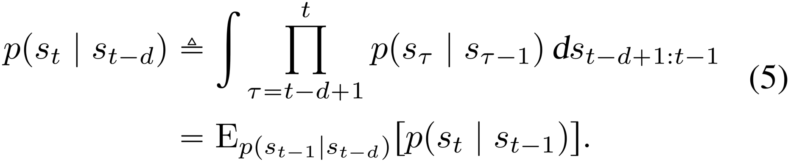

The case $d=1$ recovers the one-step transitions used in the original model. Given this definition of a multi-step prediction, we generalize Equation 3 to the variational bound on the multi-step predictive distribution $p_d$,

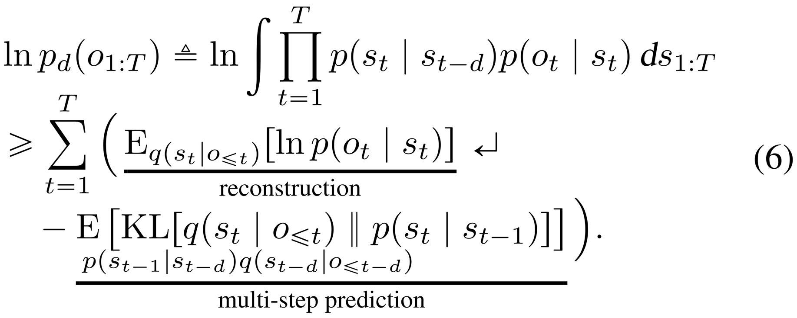

For the derivation, please see Equation 10 in the appendix. Maximizing this objective trains the multi-step predictive distribution. This reflects the fact that during planning, the model makes predictions without having access to all the preceding observations.

We conjecture that Equation 6 is also a lower bound on $\ln p(o_{1:T})$ based on the data processing inequality. Since the latent state sequences is Markovian, for $d\geq 1$ we have

Thus, Equation 10 bounds both the multi-step and one-step predictive distributions of the model. In the next paragraph, we alleviate the limitation that a particular $p_d$ does not consider the $d-1$ most recent observations at each time step and arrive at our final objective.

**Latent overshooting**&nbsp;&nbsp; We introduced a bound on predictions of a given distance $d$. However, for planning we need accurate predictions not just for a fixed distance but for all distances up to the planning horizon. We introduce latent overshooting for this, an objective function for latent sequence models that generalizes the standard variational bound (\cref{eq:elbo}) to train the model on multi-step predictions of all distances $1 \leq d \leq D$,

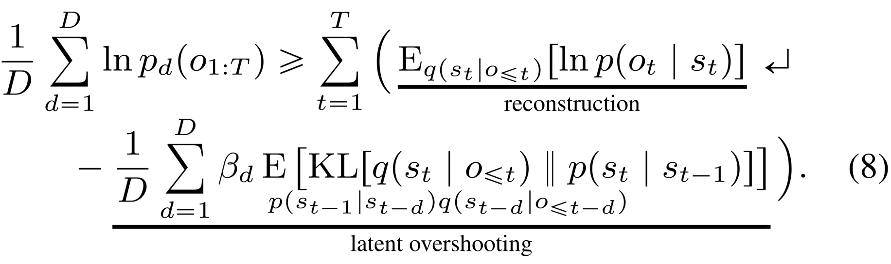

Latent overshooting can be interpreted as a regularizer in latent space that encourages consistency between one-step and multi-step predictions, which we know should be equivalent in expectation over the data set. We include weighting factors $\beta_d, d \in 1 \ldots D$ analogously to the $\beta$-VAE <dt-cite key="higgins2016beta"></dt-cite>. While we set all $\beta_{\gt 1}$ to the same value for simplicity, they could be chosen to let the model focus more on long-term or short-term predictions. In practice, we stop gradients of the posterior distributions for overshooting distances $d>1$, so that the multi-step predictions are trained towards the informed posteriors, but not the other way around. Equation 8 is the final objective function that we use to train the dynamics model of our agent.

## Experiments

We evaluate PlaNet on six continuous control tasks from pixels. We explore multiple design axes of the agent: the stochastic and deterministic paths in the dynamics model, the latent overshooting objective, and online experience collection. We refer to the appendix for hyper parameters. Besides the action repeat, we use the same hyper parameters for all tasks. Within one fiftieth the episodes, PlaNet outperforms A3C <dt-cite key="mnih2016a3c"></dt-cite> and achieves similar performance to the top model-free algorithm D4PG <dt-cite key="barth2018d4pg"></dt-cite>. The training time of 1 day on a single Nvidia V100 GPU is comparable to that of D4PG. Our implementation uses TensorFlow Probability <dt-cite key="dillon2017tfd"></dt-cite> and will be open sourced. Please see the following video of the trained agents:

<iframe src="https://streamable.com/s/wmaxz/whzzu" frameborder="0" width="100%" height="100%" allowfullscreen style="width: 100%; height: 100%; position: absolute;"></iframe>

For our evaluation, we consider six image-based continuous control tasks of the DeepMind control suite <dt-cite key="tassa2018dmcontrol">Tassa et al.</dt-cite>, shown in Figure 1. These environments provide qualitatively different challenges. The cartpole swingup task requires a long planning horizon and to memorize the cart when it is out of view, the finger spinning task includes contact dynamics between the finger and the object, the cheetah tasks exhibit larger state and action spaces, the cup task only has a sparse reward for when the ball is caught, and the walker is challenging because the robot first has to stand up and then walk, resulting in collisions with the ground that are difficult to predict. In all tasks, the only observations are third-person camera images of size 64x64x3 pixels.

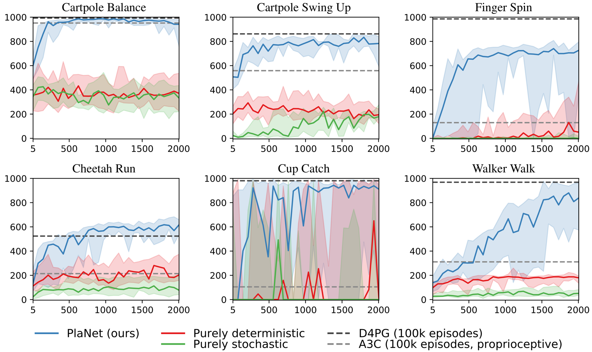
<figcaption>Figure 4: Comparison of PlaNet to model-free algorithms and other model designs. Plots show test performance for the number of collected episodes. We compare PlaNet using our RSSM to purely deterministic (RNN) and purely stochastic models (SSM). The RNN does not use latent overshooting, as it does not have stochastic latents. The lines show medians and the areas show percentiles 5 to 95 over 4 seeds and 10 rollouts. 
</figcaption>

**Comparison to model-free methods**&nbsp;&nbsp; Figure 4 compares the performance of PlaNet to the model-free algorithms reported by <dt-cite key="tassa2018dmcontrol"></dt-cite>. Within 500 episodes, PlaNet outperforms the policy-gradient method A3C trained from proprioceptive states for 100,000 episodes, on all tasks. After 2,000 episodes, it achieves similar performance to D4PG, trained from images for 100,000 episodes, except for the finger task. On the cheetah running task, PlaNet surpasses the final performance of D4PG with a relative improvement of 19%. We refer to Table 1 for numerical results, which also includes the performance of CEM planning with the true dynamics of the simulator.

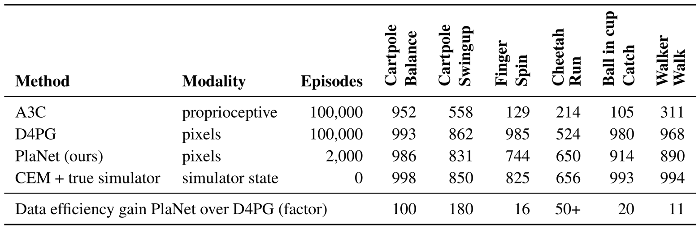
<figcaption>Table 1: Comparison of PlaNet to the model-free algorithms A3C and D4PG reported by <dt-cite key="tassa2018dmcontrol"></dt-cite>. The training curves for these are shown as orange lines in Figure~4 and as solid green lines in Figure~6 in their paper. From these, we estimate the number of episodes that D4PG takes to achieve the final performance of PlaNet to estimate the data efficiency gain. We further include CEM planning (H=12,I=10,J=1000,K=100) with the true simulator instead of learned dynamics as an estimated upper bound on performance. Numbers indicate mean final performance over 4 seeds. 
</figcaption>

**Model designs**&nbsp;&nbsp; Figure 4 additionally compares design choices of the dynamics model. We train PlaNet using our recurrent state-space model (RSSM), as well as versions with purely deterministic GRU <dt-cite key="cho2014gru"></dt-cite>, and purely stochastic state-space model (SSM). We observe the importance of both stochastic and deterministic elements in the transition function on all tasks. The stochastic component might help because the tasks are stochastic from the agent's perspective due to partial observability of the initial states. The noise might also add a safety margin to the planning objective that results in more robust action sequences. The deterministic part allows the model to remember information over many time steps and is even more important -- the agent does not learn without it.

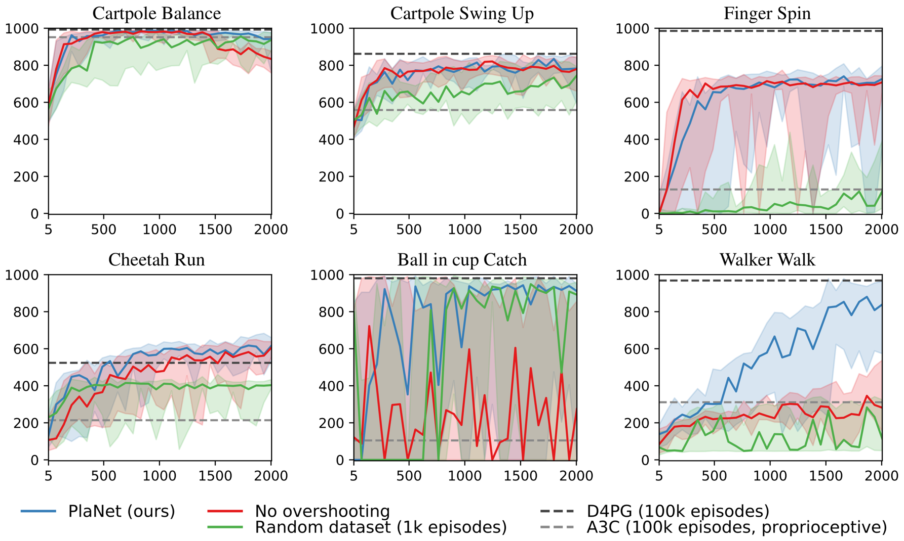
<figcaption>Figure 5: Comparison of agent designs. Plots show test performance for the number of collected episodes. We compare PlaNet using latent overshooting (Equation 8), a version with standard variational objective (Equation 3), and a version that trains from a random data set of 1000 episodes rather than collecting experience during training. The lines show medians and the areas show percentiles 5 to 95 over 4 seeds and 10 rollouts. 
</figcaption>

**Agent designs**&nbsp;&nbsp; Figure 5 compares PlaNet with latent overshooting to versions with standard variational objective, and with a fixed random data set rather than collecting experience online. We observe that online data collection helps all tasks and is necessary for the finger and walker tasks. Latent overshooting is necessary for successful planning on the walker and cup tasks; the sparse reward in the cup task demands accurate predictions for many time steps. It also slows down initial learning for the finger task, but increases final performance on the cartpole balance and cheetah tasks.

**One agent all tasks**&nbsp;&nbsp; Additionally, we train a single PlaNet agent to solve all six tasks. The agent is randomly placed into different environments without knowing the task, so it needs to infer the task from its image observations. Without changes to the hyper parameters, the multi-task agent achieves the same mean performance as individual agents. While learning slower on the cartpole tasks, it learns substantially faster and reaches a higher final performance on the challenging walker task that requires exploration.

<video class="b-lazy" data-src="assets/mp4/multi.mp4" type="video/mp4" autoplay muted playsinline loop style="display: block; margin: auto; width: 100%;" ></video>
<figcaption>
Video predictions of the PlaNet agent trained on multiple tasks. Holdout episodes are shown above with agent video predictions below. The agent observes the first 5 frames as context to infer the task and state and accurately predicts ahead for 50 steps given a sequence of actions.
</figcaption>

For this, we modify Algorithm 1 so that every time it would collect an episode, it instead collects one episode of each task. The agent is not told which task it is facing; it needs to infer this from the image observations. We use the same hyper parameters as for the main experiments above. The agent reaches the same average performance over tasks as agents individually for each task. While learning is slowed down for the cup task and the easier cartpole tasks, it is substantially improved for the difficult task of walker. This indicates that positive transfer between these tasks might be possible using model-based reinforcement learning, regardless of the conceptually different visuals. Full results available in the appendix section of our paper.

## Related Work and Discussion

Previous work in model-based reinforcement learning has focused on planning in low-dimensional state spaces <dt-cite key="gal2016deeppilco,higuera2018synthesizing,henaff2018planbybackprop,chua2018pets"></dt-cite>, combining the benefits of model-based and model-free approaches <dt-cite key="kalweit2017blending,nagabandi2017mbmf,weber2017i2a,kurutach2018modeltrpo,buckman2018steve,ha2018worldmodels,wayne2018merlin,igl2018dvrl,srinivas2018upn"></dt-cite>, and pure video prediction without planning <dt-cite key="oh2015atari,krishnan2015deepkalman,karl2016dvbf,chiappa2017recurrent,babaeizadeh2017sv2p,gemici2017temporalmemory,denton2018stochastic,buesing2018dssm,doerr2018prssm,gregor2018tdvae"></dt-cite>.

**Planning in state space**&nbsp;&nbsp; When low-dimensional states of the environment are available to the agent, it is possible to learn the dynamics directly in state space. In the regime of control tasks with only a few state variables, such as the cart pole and mountain car tasks, PILCO <dt-cite key="deisenroth2011pilco"></dt-cite> achieves remarkable sample efficiency using Gaussian processes to model the dynamics. Similar approaches using neural networks dynamics models can solve two-link balancing problems <dt-cite key="gal2016deeppilco,higuera2018synthesizing"></dt-cite> and implement planning via gradients <dt-cite key="henaff2018planbybackprop"></dt-cite>. <dt-cite key="chua2018pets">Chua et al.</dt-cite> use ensembles of neural networks, scaling up to the cheetah running task. The limitation of these methods is that they access the low-dimensional Markovian state of the underlying system and sometimes the reward function. <dt-cite key="amos2018awareness">Amos et al.</dt-cite> train a deterministic model using overshooting in observation space for active exploration with a robotics hand. We move beyond low-dimensional state representations and use a latent dynamics model to solve control tasks from images.

**Hybrid agents**&nbsp;&nbsp; The challenges of model-based RL have motivated the research community to develop hybrid agents that accelerate policy learning by training on imagined experience <dt-cite key="kalweit2017blending,nagabandi2017mbmf,kurutach2018modeltrpo,buckman2018steve,ha2018worldmodels"></dt-cite>, improving feature representations <dt-cite key="wayne2018merlin,igl2018dvrl"></dt-cite>, or leveraging the information content of the model directly <dt-cite key="weber2017i2a"></dt-cite>. <dt-cite key="srinivas2018upn">Srinivas et al.</dt-cite> learn a policy network with integrated planning computation using reinforcement learning and without prediction loss, yet require expert demonstrations for training.

**Multi-step predictions**&nbsp;&nbsp; Training sequence models on multi-step predictions has been explored for several years. Scheduled sampling <dt-cite key="bengio2015scheduled"></dt-cite> changes the rollout distance of the sequence model over the course of training. Hallucinated replay <dt-cite key="talvitie2014hallucinated"></dt-cite> mixes predictions into the data set to indirectly train multi-step predictions. <dt-cite key="venkatraman2015dad">Venkatraman et al.</dt-cite> take an imitation learning approach. Recently, <dt-cite key="amos2018awareness">Amos et al.</dt-cite> train a dynamics model on all multi-step predictions at once. We generalize this idea to latent sequence models trained via variational inference.

**Latent sequence models**&nbsp;&nbsp; Classic work has explored models for non-Markovian observation sequences, including recurrent neural networks (RNNs) with deterministic hidden state and probabilistic state-space models (SSMs). The ideas behind variational autoencoders <dt-cite key="kingma2013vae,rezende2014vae"></dt-cite> have enabled non-linear SSMs that are trained via variational inference <dt-cite key="krishnan2015deepkalman"></dt-cite>. The VRNN <dt-cite key="chung2015vrnn"></dt-cite> combines RNNs and SSMs and is trained via variational inference. In contrast to our RSSM, it feeds generated observations back into the model which makes forward predictions expensive. <dt-cite key="karl2016dvbf">Karl et al.</dt-cite> address mode collapse to a single future by restricting the transition function,<dt-cite key="moerland2017learning"></dt-cite> focus on multi-modal transitions, and <dt-cite key="doerr2018prssm">Doerr et al.</dt-cite> stabilize training of purely stochastic models. <dt-cite key="buesing2018dssm">Buesing et al.</dt-cite> propose a model similar to ours but use in a hybrid agent instead for explicit planning.

**Video prediction**&nbsp;&nbsp; Video prediction is an active area of research in deep learning. <dt-cite key="oh2015atari">Oh et al.</dt-cite> and <dt-cite key="chiappa2017recurrent">Chiappa et al.</dt-cite> achieve visually plausible predictions on Atari games using deterministic models. <dt-cite key="kalchbrenner2016vpn">Kalchbrenner et al.</dt-cite> introduce an autoregressive video prediction model using gated CNNs and LSTMs. Recent approaches introduce stochasticity to the model to capture multiple futures <dt-cite key="babaeizadeh2017sv2p,denton2018stochastic"></dt-cite>. To obtain realistic predictions, <dt-cite key="mathieu2015deep">Mathieu</dt-cite> and <dt-cite key="vondrick2016generating">Vondrick</dt-cite> use adversarial losses. In simulated environments, <dt-cite key="gemici2017temporalmemory">Gemici et al.</dt-cite> augment dynamics models with an external memory to remember long-time contexts. <dt-cite key="van2017vq">Van et al.</dt-cite> propose a variational model that avoids sampling using a nearest neighbor look-up, yielding high fidelity image predictions. These models are complimentary to our approach.

Relatively few works have demonstrated successful planning from pixels using learned dynamics models. The robotics community focuses on video prediction models for planning <dt-cite key="agrawal2016poking,finn2017foresight,ebert2018foresight"></dt-cite> that deal with the visual complexity of the real world and solve tasks with a simple gripper, such as grasping or pushing objects. In comparison, we focus on simulated environments, where we leverage latent planning to scale to larger state and action spaces, longer planning horizons, as well as sparse reward tasks. E2C <dt-cite key="watter2015e2c"></dt-cite> and RCE <dt-cite key="banijamali2017rce"></dt-cite> embed images into a latent space, where they learn local-linear latent transitions and plan for actions using LQR. These methods balance simulated cartpoles and control 2-link arms from images, but have been difficult to scale up. We lift the Markov assumption of these models, making our method applicable under partial observability, and present results on more challenging environments that include longer planning horizons, contact dynamics, and sparse rewards.

In this work, we present PlaNet, a model-based agent that learns a latent dynamics model from image observations and chooses actions by fast planning in latent space. To enable accurate long-term predictions, we design a model with both stochastic and deterministic paths and train it using our proposed latent overshooting objective. We show that our agent is successful at several continuous control tasks from image observations, reaching performance that is comparable to the best model-free algorithms while using 50x fewer episodes and similar training time. The results show that learning latent dynamics models for planning in image domains is a promising approach.

Directions for future work include learning temporal abstraction instead of using a fixed action repeat, possibly through hierarchical models. To further improve final performance, one could learn a value function to approximate the sum of rewards beyond the planning horizon. Moreover, exploring gradient-based planners could increase computational efficiency of the agent. Our work provides a starting point for multi-task control by sharing the dynamics model.

*If you would like to discuss any issues or give feedback regarding this work, please visit the [GitHub](https://github.com/planetrl/planetrl.github.io/issues) repository of this article.*
